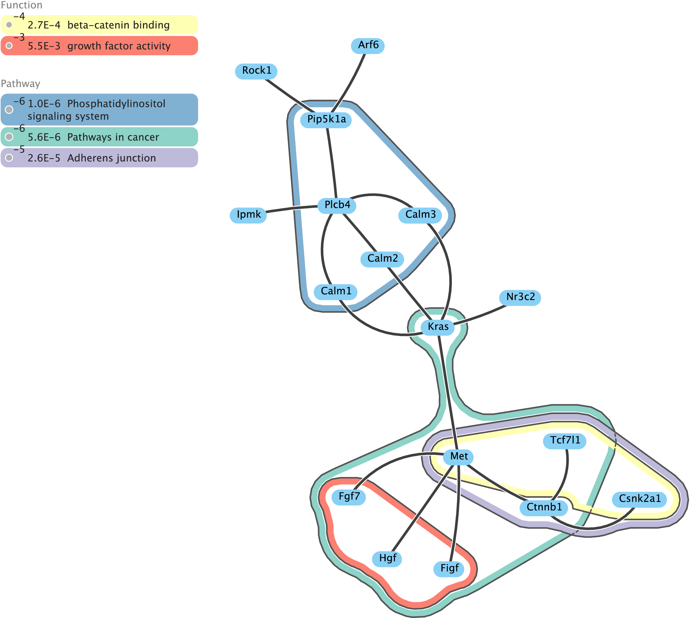
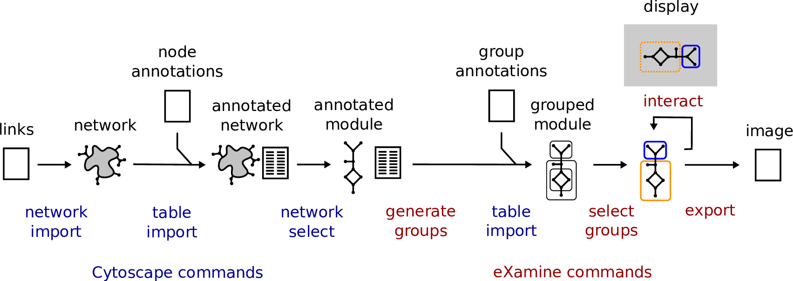

eXamine
=======

eXamine is a Cytoscape app for a set-oriented visual analysis approach for annotated modules that displays set membership as contours on top of a node-link layout.

Compilation instruction
-----------------------

Apache Maven is required to compile the code via:

    mvn install

Installation instructions
-------------------------

We recommend to install eXamine from the [Cytoscape app store](http://apps.cytoscape.org/apps/examine).

Usage instructions
------------------

eXamine can be used in two different ways. First, eXamine can be operated through the Cytoscape GUI (described [here](doc/tutorial/tutorial.pdf)). Second, eXamine can be operated through the Cytoscape command interface from either Python (described [here](doc/tutorial/eXamineNotebook/eXamineTutorial.ipynb) and [here](doc/tutorial/eXamineNotebook/eXamineTutorial2.pdf)) or R (described [here](doc/tutorial/eXamineNotebook/eXamineTutorial_R.Rmd) and [here](doc/tutorial/eXamineNotebook/eXamineTutorial2_R.Rmd)). For both cases the typical workflow is depicted below.

